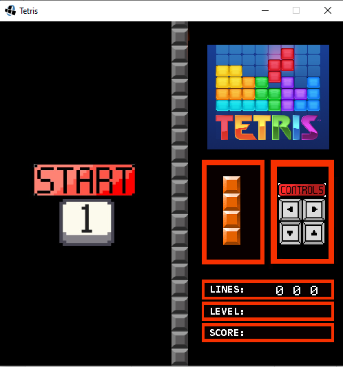
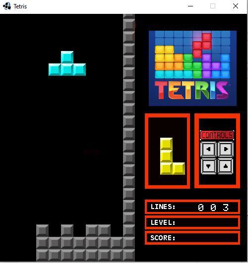

# WollokTetris 
# Autor: Ezequiel Pelozo (Universidad de Hurlingham)
## Capturas


## COMANDOS
**Se empieza con el 1 y se utilizan las flechas para mover y rotar la pieza. Para salir se presiona E**
# COMPONENTES Y ESTRUCTURA
**El Tetris es un juego del tipo puzzle donde irá descendiendo una figura (pieza)
dentro de un rectángulo (tablero o mapa). Una vez que ésta colisiona con el borde inferior del rectángulo o contra otra figura, se estampará allí y se lanzará una nueva pieza. Éstas deberán ser ubicadas de manera tal de llenar filas para que sean eliminadas, evitando que lleguen hasta el extremo superior.**

## LA CLASE PIECE
**La clase Piece se encargará de almacenar, trasladar, rotar y mostrar la pieza en escena. La pieza estará representada por una matriz cuadrada, para visualizarlo vemos el siguiente ejemplo:**


```
{3,
0, 1, 0,
1, 1, 1,
0, 0, 0},
{3,
1, 0, 0,
1, 1, 0,
0, 1, 0},
{3,
0, 1, 0,
1, 1, 0,
1, 0, 0},
{3,
0, 1, 0,
0, 1, 0,
0, 1, 1},
{3,
0, 1, 0,
0, 1, 0,
1, 1, 0},
{4,
0, 1, 0, 0,
0, 1, 0, 0,
0, 1, 0, 0,
0, 1, 0, 0}
}
```
## LA CLASE BOARD
**La clase BoardMap será la encargada de manipular el tablero o mapa del juego y de
las verificaciones de colisión. Cada vez que seleccionamos una pieza y la lanzamos
desde el borde superior, verificaremos en cada chequeo de reglas si colisiona o no
con alguna otra pieza o con algún extremo del mapa.**

**A grandes rasgos, podríamos establecer que, cuando la pieza no colisiona contra nada dentro del mapa, la posición hacia la cual deseamos moverla es válida y podremos actualizar definitivamente su posi**

**En un determinado momento, la pieza colisionará contra otra o contra el borde inferior del mapa; llegada esta situación, se procederá a estamparla, es decir, se copiará la información que describe la pieza en el arreglo que representa el mapa. uego el objeto pieza se reutilizará, seleccionando otra cualquiera (al azar) y volviéndola a soltar desde el borde superior del mapa.**
